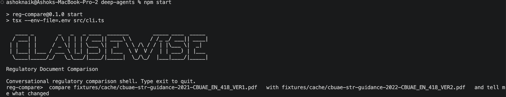

# Clausewise

**Clausewise** compares two regulatory documents **by theme and evidence**, not by line diff, and
produces an auditable result a compliance reviewer can sign off on. You talk to it in plain
language; it resolves what you meant, runs the work, stops for your approval at the two points
that matter, and then answers questions about what it found.

Status: **conversational harness operational.** The build contract is [SPEC.md](./docs/SPEC.md); the
reasoning behind it is [DECISIONS.md](./docs/DECISIONS.md).

> The command is still `reg-compare` while the binary rename lands in `package.json`. Every
> example below uses the current command name.

---

## What problem does this solve, for whom, and what's the measurable outcome?

### The problem

When a regulator publishes new AML/CFT material, a compliance team has to answer three
questions: what changed, which obligations now require action, and where do our policies fall
short of the requirement. Today that answer is produced by an analyst reading both documents
end to end and annotating by hand — days of work per publication, repeated across every
circular, consultation, and version bump, and the quality of the answer depends entirely on who
was assigned to read it.

The two obvious shortcuts both fail:

- **A textual diff cannot answer these questions.** Two documents routinely describe the same
  obligation with different structure, scope, legal status, and vocabulary — so a diff reports
  hundreds of irrelevant edits and misses the one substantive change.
- **A general-purpose LLM produces fluent summaries nobody can audit.** Ask a chatbot to
  "compare these PDFs" and you get prose with no traceable link to source text — unusable in
  front of a regulator, an internal auditor, or a board risk committee, because a claim you
  cannot locate in the source is a claim you cannot defend.

### For whom

| Audience | What they get |
| --- | --- |
| **Compliance analysts and regulatory-change teams** at regulated institutions | A first-pass thematic comparison with citations already verified, so the read is review rather than discovery |
| **MLROs and heads of compliance** signing off on impact assessments | An evidence package where every material finding resolves to a page or line in the source, and their own disposition is part of the record |
| **Second-line risk and internal audit** | A reproducible artifact: same inputs and same decisions produce the same run directory, so a conclusion can be re-derived months later |
| **Advisors and external counsel** running impact assessments for clients | A defensible working paper rather than a chat transcript |

The common thread: people whose output has to survive being questioned. The tool is built for
the moment *after* the analysis, when someone asks "where does it say that?"

### The measurable outcome

Every run emits its own instrumentation into the `coverage` block of `analysis.json` and the
records under `audit/`. These are the numbers the tool is held to — not marketing claims, but
fields you can read off a completed run:

| Measure | Field | Target |
| --- | --- | --- |
| Findings whose every citation resolves to stored source text | `coverage.verified_finding_ratio` | **1.0** — enforced, not aspired to; a finding with an unverifiable citation cannot reach `analysis.json` |
| Approved themes that produced a defensible result | `coverage.theme_outcome_ratio` | 1.0 for a `complete` run; anything less forces an explicit partial-finalization decision |
| Source actually examined, not sampled away | `coverage.ingestion_page_ratio`, `mapper_heading_ratio`, `mapper_body_sample_ratio` | Reported per run so truncation is visible rather than silent |
| Claims the model made that the audit threw out | count in `audit/rejected-findings-1.json` | Recorded every run — a rising rejection rate is a signal about the model, and it is measured rather than guessed |
| Known concepts a fixture comparison must surface | `coverage.fixture_required_concept_ratio` | Asserted in the sanity suite, so regressions in analytical quality fail a test instead of reaching a reviewer |

Two outcomes are not captured in a field and should be stated honestly as the intent behind the
design rather than as measured results:

- **Reviewer attention is concentrated, not replaced.** A human dispositions every `critical`
  and `high` action candidate — a bounded list — instead of reading two full documents. The
  gate is mandatory; the savings come from narrowing what needs judgment, not from removing it.
- **Turnaround moves from days to a working session.** Ingestion, theme mapping, and per-theme
  comparison are minutes of machine time. The wall-clock figure for your documents depends on
  their size and your model; measure it on your own corpus before quoting it to anyone.

What the tool deliberately does *not* optimize for is finding count. More findings is not a
better run; a finding that survives citation audit is worth more than ten that do not.

Under the conversation, a bounded workflow runs:

1. **Ingest** two local documents (`.pdf`, `.md`, `.txt`) and normalize them into records that
   keep page or line locators.
2. **Map themes** — a mapper subagent proposes a ranked catalogue of regulatory themes covered
   by the pair.
3. **Human gate #1** — you approve, amend, or reject that plan before any analysis spend. An
   amendment is remapped into a second derived plan, which must be approved in turn; reviewers
   never directly edit theme structures, record IDs, or plan hashes.
4. **Compare per theme** — each approved theme gets its own subagent with its own context,
   examining how both documents treat it.
5. **Audit the evidence** — every finding's citations are mechanically verified against the
   stored source text. Unverifiable claims are rejected, not softened.
6. **Human gate #2** — you disposition every `critical` and `high` action candidate.
7. **Publish** `analysis.json` (canonical) and `report.md` (reviewer-facing), then keep talking
   about the result.

Everything needed to audit the result — sources, coordinator-built packets, structured worker
attempt results and outcomes, rejected findings, review decisions, model provenance, logs — is
written to a self-contained run directory. The run *is* the evidence package.

### Four comparison profiles

One engine, one result schema, four analysis semantics:

| Profile | Compares | Answers |
| --- | --- | --- |
| `consultation-impact` | current rule vs. a regulator consultation paper | what would this proposal cost us? |
| `version-change` | earlier vs. later version of an instrument | what materially changed? |
| `cross-guidance` | two guidance documents on one topic | do they align, differ in scope, or conflict? |
| `policy-gap` | external requirement vs. our public policy posture | where are the gaps? |

You do not have to name the profile. The shell agent infers it from what you asked and tells you
which one it picked; you can override it in the same sentence or at the plan gate.

### The non-negotiables

These are what separate this from a chat prompt, and they are release gates:

- **Every material finding cites exact, verifiable source text.** The model supplies only the
  record range; the harness quotes the source itself from that span, so a citation cannot misquote
  what it cites. A range that does not resolve, or that is too broad to be evidence, is rejected
  and cannot reach `analysis.json` or `report.md`.
- **A human approves the scope, and a human dispositions the consequences.** Two mandatory
  gates, enforced in the graph rather than in a prompt: the model cannot reach a finalized run
  without passing through both. Non-interactive approval exists only for automated fixtures and
  is marked as such in the record.
- **The conversation is not the record.** Chat is the interface; the run directory is the
  evidence. Nothing a reviewer signs off on lives only in a transcript, and nothing said in
  conversation changes an artifact that has already been written.
- **The model chooses what to analyze; it never decides what counts as verified.** Its only
  tools are harness verbs, each of which validates before it writes. It can pick sources,
  profile and themes; it cannot admit an unverified citation, skip a gate, or edit a finalized
  artifact.
- **Code execution is scoped.** A QuickJS REPL with allowlisted artifact read/write/list
  operations — no shell, no processes, no host filesystem, no network. Every program and result
  is logged.


---

## Why it's shaped this way

This is a Deep Agents capstone. The regulatory use case is real, but the architecture is
deliberately built to exercise four capabilities under conditions where getting them wrong is
visible:

| Capability | How it shows up here |
| --- | --- |
| Planning + human-in-the-loop | Graph-level interrupts and durable review records: plan review before spend, finding dispositions before publication |
| Subagent delegation | One mapper, then N in-process DeepAgents theme workers, each with a bounded context packet |
| Filesystem context offloading | The run workspace is the durable evidence package; workers see only `/input/packet.json` in disposable scratch storage |
| Code execution | Scoped QuickJS, exposed to theme workers as a brokered tool for bounded local computation |

Compliance work is a good forcing function: hallucinated findings are not a cosmetic flaw, they
are the whole failure mode. That is why the evidence contract is mechanical rather than a prompt
instruction.

## Stack and architecture

Four layers:

- **Shell agent — [deepagents](https://www.npmjs.com/package/deepagents) on LangGraph.** Turns
  natural language into harness verbs. Owns the conversation, resolves intent, explains results.
  Its tools are the only way it can affect anything.
- **Coordinator — TypeScript.** Everything that must be reproducible: the workflow state
  machine, normalization, zod validation, citation verification, retry policy, budgets,
  materiality gating, report rendering. Sole writer of durable artifacts.
- **Semantic delegates — deepagents subagents.** The mapper and the per-theme comparison
  workers. Isolated context, no shell or network tools, results returned as JSON that is schema-
  validated before it reaches the coordinator.
- **Reasoning engine — an open model via OpenRouter.** Drives both the shell loop and the
  delegates. Configured by environment, pinned for reproducibility, recorded per run.

```text
                    +---------------------------------------------+
                    |  reg-compare      (no subcommand -> chat)    |
                    |  run  resume  validate  inspect  doctor      |
                    +----------------------+----------------------+
                                           |
                     natural language      |      scripted flags
                                           v
+----------------------------------------------------------------------+
|  SHELL AGENT                        deepagents / LangGraph           |
|                                                                      |
|  resolves intent, picks profile + sources, explains results          |
|  tools: inspect_sources  start_run   create_plan   submit_plan       |
|         analyze_themes   finalize_run  inspect_run  validate_run     |
|         read_findings                                                 |
|  interrupts on: submit_plan, finalize_run; MemorySaver is session-only |
+----------------------------------+-----------------------------------+
                                   |  every tool call
                                   v
+----------------------------------------------------------------------+
|  COORDINATOR                       TypeScript - deterministic        |
|                                                                      |
|  workflow state machine  |  zod schema validation  |  retry policy   |
|  citation verification   |  materiality gating     |  report render  |
|  call budgets            |  model provenance       |  event ledger   |
|                                                                      |
|  * sole writer of durable artifacts *  * gates cannot be bypassed *  |
+-----+----------------------+----------------------+------------------+
      |                      |                      |
  delegates              verifies               persists
      v                      v                      v
+------------------+   +-----------------+   +--------------------+
| SEMANTIC         |   |     QuickJS     |   |   RUN WORKSPACE    |
| SUBAGENTS        |   |  scoped REPL    |   |  evidence package  |
|                  |   |                 |   |                    |
| mapper      x1   |   | list / read /   |   | sources/ planning/ |
| theme worker xN  |   | writeArtifact() |   | reviews/ workers/  |
| (<=3 at once)    |   |                 |   | audit/   quickjs/  |
|                  |   | no shell, net,  |   | logs/    events/   |
| own context      |   | process, or fs  |   | analysis.json      |
| no shell/network |   | 1s / 32MB caps  |   | report.md          |
| JSON out only    |   +-----------------+   +--------------------+
+-----+------------+
      |
      |  every semantic call
      v
+--------------------------------+
|   OpenRouter -> open model     |
|        << LLM BRAIN >>         |
|                                |
|  drives the shell loop and     |
|  the per-theme comparisons     |
|  temperature 0, pinned route   |
|  model + provider recorded     |
+---------------+----------------+
                |
                |  untrusted until schema + citations validated
                +--------->  back to COORDINATOR
```

### A note on worker isolation

Earlier builds ran each theme worker as a separate sandboxed OS process with network egress
denied. Subagents give up that boundary, and the README should say so plainly. What replaces it:

- Each delegate gets its own context — source text never enters the shell agent's conversation.
- Delegates hold no shell, network, or host-filesystem tools; the only capability they have
  beyond reading their context packet is the scoped QuickJS bridge.
- That packet lives in a per-delegate temporary directory, and the read is scoped to it by an
  allow rule ahead of a deny-everything rule. `FilesystemBackend` addresses **real** filesystem
  paths rather than a chroot, so the permission globs, the prompt, and the backend are all built
  from the same canonicalized (`realpath`) scratch directory. A virtual-looking path such as
  `/input/packet.json` is not scoped to the sandbox — it resolves against the host root.
- The delegate's backend runs in `virtualMode`, so `rootDir` is a genuine virtual root: the
  delegate addresses `/input/packet.json`, traversal (`..`, `~`) and absolute escapes are refused
  by the backend, and the permission globs match the namespace the delegate is told about. Without
  it `rootDir` is only a cwd for relative paths and an absolute path resolves against the host root.
- The QuickJS broker's Unix socket lives in its own short-named directory, not under the delegate
  scratch path. A socket path is capped by `sockaddr_un.sun_path` (104 bytes on macOS, 108 on
  Linux), and a scratch-relative path exceeded it — `listen()` bound nothing and the broker could
  not start. Scripts are passed to the broker in memory and never written to disk.
- A delegate's result crosses back into the coordinator **only** as a JSON object that is zod-
  validated and citation-audited. It is never spliced into the shell agent's message history as
  free text.

That last point is the one that matters: source documents are treated as hostile input, and
prompt injection in a PDF must not reach the agent that holds `finalize_run`. The shell’s source
discovery tool returns only path, type, and size metadata; source ingestion and packet construction
stay in TypeScript.

The shell uses `MemorySaver` only for the live conversation. It is not a run-resume database. The
immutable workspace ledger and its validated state projection remain authoritative, and the
coordinator holds a workspace lock only while executing one staged operation—not while a reviewer
is deciding at a gate.

Supporting: `pdfjs-dist` for PDF extraction with page boundaries, `quickjs-emscripten` for the
scoped REPL, `@langchain/openai` for the OpenRouter adapter, `commander` for the CLI.

Fixtures are real, public, English-language UAE sources — primarily CBUAE AML/CFT material —
pinned by URL, publication metadata, and SHA-256 so tests never hit the network.

Tests run at three non-networked levels: deterministic unit tests for isolation, ledger, routing,
review, citation, and QuickJS contracts; integration tests for CLI and workflow boundaries; and
local sanity/fixture checks. An explicitly configured real-model regression is a separate manual
operation and validates invariants (schema, citations, coverage, materiality, audit records)
rather than snapshotting model prose.

## Interface

Conversational — the default with no subcommand. `npm start` is the supported launcher: it runs
the CLI through `tsx --env-file=.env`, so your credentials load automatically.



Naming the files is optional — `inspect_sources` resolves a plain-language request such as
`compare the 2021 and 2022 CBUAE STR guidance` against the fixture cache, and the shell tells
you which pair and profile it picked so you can correct it before the plan gate. Follow-up
questions run against the finished run:

```console
reg-compare> why is thm-002 only medium materiality?
reg-compare> show me the evidence for f-003
```

Scripted — unchanged, for CI and fixtures:

```bash
reg-compare doctor                      # local preflight: node, npm, QuickJS

reg-compare run \
  --profile consultation-impact \
  --baseline ./documents/current-aml-guidance.pdf \
  --candidate ./documents/proposed-rule.pdf \
  --data-classification public \
  --output ./runs/aml-consultation \
  --auto-approve

reg-compare resume   --run ./runs/aml-consultation   # continue at the gate it stopped on
reg-compare validate --run ./runs/aml-consultation   # re-check a run, no model calls
reg-compare inspect  --run ./runs/aml-consultation   # summarize a run
```

Both paths use the same durable schema, ledger, and validation rules. Timestamps and generated
run IDs intentionally prevent byte-for-byte identity across independently started runs. A run
started in conversation can be inspected, validated, or continued with the scripted commands.

## Configuration

Create a local `.env` with your key and routing settings. `npm start` loads it; `.env` is gitignored.

```bash
OPENROUTER_API_KEY=sk-or-v1-...              # or REG_COMPARE_API_KEY
REG_COMPARE_PROVIDER_ORDER=GMICloud          # required pinned OpenRouter route
REG_COMPARE_MODEL=minimax/minimax-m3:free    # optional; code default is deepseek/deepseek-chat
REG_COMPARE_BASE_URL=https://openrouter.ai/api/v1  # optional OpenAI-compatible endpoint
```

Invoking the CLI any other way (`npx tsx src/cli.ts`, or the built `dist/cli.js`) does **not**
read `.env` — nothing in `src/` calls a dotenv loader. Pass `--env-file=.env` yourself, or
export the variables.

**`REG_COMPARE_PROVIDER_ORDER` must name a provider that actually serves your chosen model.**
Runs pin `allow_fallbacks: false` for reproducibility, so a provider that does not serve the
model leaves zero endpoints and every request 404s with `No endpoints found`. The provider slug
is not the vendor name — `deepseek/deepseek-chat` is served by `DeepInfra` and `StreamLake`, not
by a provider called `DeepSeek`. List the real routes before pinning:

```bash
curl -s "https://openrouter.ai/api/v1/models/<author>/<slug>/endpoints" \
  -H "Authorization: Bearer $OPENROUTER_API_KEY" | jq '.data.endpoints[].provider_name'
```

### Free-tier accounts

The shell and every worker require tool calling. OpenRouter catalog availability changes, so do
not hardcode a free-model list: the authenticated catalog query during this session returned 431
text models, 22 zero-cost text models, and 17 zero-cost models advertising both `tools` and
`tool_choice`. The configured `minimax/minimax-m3:free` route resolves to GMICloud and currently
advertises both capabilities with a 1M-token context window. Run the catalog query again before
changing model or provider routing.

A `:free` variant has zero token price but still has account and rate-limit constraints. Two
failure modes worth recognizing:

- **`402 ... requires more credits, or fewer max_tokens`** means the account/key does not have
  sufficient available credit for that request. The harness does not set `max_tokens`; the model
  and provider decide their own default completion cap. In the shell this surfaces as
  `model_error` unless a typed harness stage can classify it further.
- **`404 This model is unavailable for free`** means the selected free variant is unavailable or
  retired. Re-query the catalog and endpoint list rather than assuming a paid replacement is
  accessible to the key.

`doctor --network` can still report PASS in both cases: it probes the catalog endpoint, not a
completion or the selected model's endpoints, so it confirms neither request affordability nor
model-specific route availability.

`reg-compare doctor` checks Node, npm, and QuickJS locally. API-key and routing configuration
are reported but do not make the local doctor fail; endpoint reachability is an explicit
`doctor --network` check. This keeps the normal test suite non-networked.

Before any external request, the model adapter requires a key and provider order. Every run
records model ID, base URL, temperature `0`, provider order, `allow_fallbacks: false`, and
`data_collection: "deny"` in `manifest.json`; the same routing object is forwarded to
OpenRouter on provider requests.

### Budgets

There are deliberately two distinct limits:

| Limit | Scope |
| --- | --- |
| `--agent-call-budget` (2–48) | External **analysis provider requests**, including mapper/worker tool loops and retries |
| `LIMITS.maxShellModelCalls` (100) | In-memory shell-session requests; independent of any run and reset when the shell exits |

Immediately before every mapper or worker chat-model request, a callback atomically reserves one
analysis call. The reservation writes an immutable `model_call_started` ledger event with a state
projection. `validate` reconciles those events against `run-state.json` and the configured budget,
so retries cannot silently spend past the cap. A mapper and each theme worker have an independent
three-request ceiling; the plan reserves a minimum of two remaining requests for every approved
theme, preventing a mapper loop from consuming the entire run budget.

Note that a delegate is an agentic loop, not a single inference: reading the packet costs one
request, answering costs another, and each structured-output repair costs one more. A
three-request ceiling therefore leaves room for roughly one repair, and a delegate that needs an
extra tool turn exhausts it. When it does, the delegate's outcome is `model_error`, which reads
as model incapability even when the cause is the harness — check the attempt artifact before
concluding the model is at fault.

### Diagnosing a failed delegate

A failed mapper or worker attempt records the real reason, not just its outcome class:

| File | Contents |
| --- | --- |
| `planning/mapper-attempt-<n>.json` | Outcome plus the underlying error in `stderr`, redacted and bounded by `LIMITS.workerErrorBytes` |
| `planning/mapper-rejected-<n>.json` | The model output that was rejected, so a schema failure can be inspected |
| `workers/<theme>/attempt-<n>.json` | The same for each theme worker |
| `logs/orchestrator.ndjson` | Stage-level operational log |

Earlier builds deliberately stored no exception text; that made a genuine failure impossible to
diagnose, and the decision was reversed. Credentials are redacted before anything is written.

### Data classification

`--data-classification internal` or `confidential` requires
`--confirm-external-model-access`, acknowledging that document text is sent to the configured
inference endpoint — OpenRouter and its selected upstream provider — whose retention terms are
outside this tool's control. `confidential` additionally requires
`--confirm-encrypted-workspace` and `--retention-until`. The consent assertion and routing
provenance are retained in the immutable manifest. Review your provider's data policy before
classifying anything above `public`.

## Current state

| | |
| --- | --- |
| Specification | [SPEC.md](./docs/SPEC.md) — approved build spec |
| Decision log | [DECISIONS.md](./docs/DECISIONS.md) |
| Implementation | conversational harness operational; batch path at parity |

Technical spikes that gate "core complete" (SPEC §16): reliable structured output and multi-turn
tool-calling from the configured model, QuickJS embedding without leaking Node capabilities, PDF
page/quote stability good enough for exact citation verification, and public-source
redistribution rights. If a spike fails, the rule is to stop at that boundary and revise the
spec — not to quietly weaken the security or evidence guarantees.
